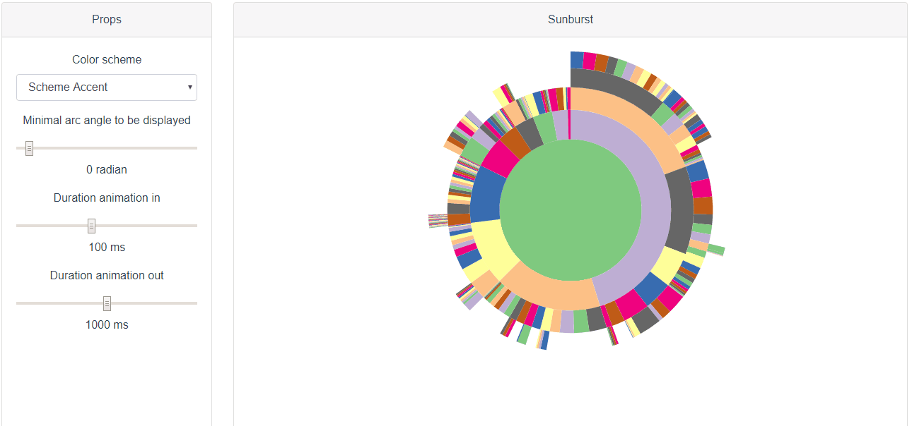

# Vue.D3.Sunburst

[](https://github.com/David-Desmaisons/Vue.D3.sunburst/issues)
[](https://www.npmjs.com/package/vue-d3-sunburst)
[](https://github.com/David-Desmaisons/Vue.D3.sunburst/blob/master/LICENSE)



## Live example:

https://david-desmaisons.github.io/Vue.D3.sunburst/

## About 

Vue.D3.Sunburst provides a reusable vue [sunburst charts](http://www.cc.gatech.edu/gvu/ii/sunburst/) component relying on [D3.js](https://d3js.org/).

`Sunburst` is the main component of this library and display sunburst chart based on `data` props using `children` property for hierarchy, `name` property for naming and `size` property for arcs size.

`Sunburst` component provides three optional slots:

  * `legend` and `top` slots are intended to be used to display additional information such as legend
  * `default slot` is intended to receive renderless component providing behavior: for example, highlighting on mouse over or zoom on click

Components providing standard and reusable features are provided.

## Features

  * Reactive to data changes
  * Responsive to size changes
  * Customizable with slot or exposed methods and events
  * Zoomable 
  

## Install

```
npm i vue-d3-sunburst
```

## Usage

```HTML
<sunburst :data="data">

  <!-- Add behaviors -->
  <template slot-scope="{ on, actions }">
    <highlightOnHover v-bind="{ on, actions }"/>
    <zoomOnClick v-bind="{ on, actions }"/>
  </template>

  <!-- Add information to be displayed on top the graph -->
  <nodeInfoDisplayer slot="top" slot-scope="{ nodes }" :current="nodes.mouseOver" :root="nodes.root" description="of visits begin with this sequence of pages" />

  <!-- Add bottom legend -->
  <breadcrumbTrail slot="legend" slot-scope="{ nodes, colorGetter, width }" :current="nodes.mouseOver" :root="nodes.root" :colorGetter="colorGetter" :from="nodes.clicked" :width="width" />

</sunburst>
```

```javascript
import {
  breadcrumbTrail,
  highlightOnHover,
  nodeInfoDisplayer,
  sunburst,
  zoomOnClick
} from 'vue-d3-sunburst';
import "vue-d3-sunburst/dist/vue-d3-sunburst.css";

export default {
  components: {
    breadcrumbTrail,
    highlightOnHover,
    nodeInfoDisplayer,
    sunburst,
    zoomOnClick
  },
  data() {
    return { 
      tree:  {
      "name": "flare",
        "children": [
          {
            "name": "analytics",
            "children": [
              {
                "name": "cluster",
                "children": [
                  { "name": "AgglomerativeCluster", "size": 3938 },
                  { "name": "CommunityStructure", "size": 3812 },
                  { "name": "HierarchicalCluster", "size": 6714 },
                  { "name": "MergeEdge", "size": 743 }
                ]
              },
              {
                "name": "graph",
                "children": [
                  { "name": "BetweennessCentrality", "size": 3534 },
                  { "name": "LinkDistance", "size": 5731 },
                  { "name": "MaxFlowMinCut", "size": 7840 },
                  { "name": "ShortestPaths", "size": 5914 },
                  { "name": "SpanningTree", "size": 3416 }
                ]
              },
              {
                "name": "optimization",
                "children": [
                  { "name": "AspectRatioBanker", "size": 7074 }
                ]
              }
            ]
          }
        ]
      }
    }
  }
}
```

## Gotchas

This component is responsive and will adjust to resizing. In order for this to work properly, you must define for this component or its parent wether:

* a height or a max-height
* or a width or a max-width.

Failing to do so may result in a component whose size that will keep increasing.

## API

### sunburst 

#### slots 

- `legend` Use this slot to add information on top or bottom of the graph 

- `top` Use this slot to add information on top of the graph 

- `default` Use this slot to add behaviors to the sunburst 

#### props 

- `data` ***Object*** (*optional*) 

   Sunburst data where children property is a array containing children. 

- `color-scheme` ***String*** (*optional*) `default: provided by injected defaultSchemeColor with a fall back to schemeAccent` 

   D3 color scheme to be used.
  
- `color-scale` ***Function*** (*optional*) `default: undefined`

   D3 scale of colors ([d3-scale](https://github.com/d3/d3-scale)). If specified, it overwrites the color-scheme props

- `get-category-for-color` ***Function*** (*optional*) `default: 'useNameForColor'` 

   Function used to map an item and its color. (nodeD3: Object) => category: Number | String By default use the node name 

- `min-angle-displayed` ***Number*** (*optional*) `default: 0.005` 

   Minimal arc angle to be displayed (in radian). 

- `arc-identification` ***Function*** (*optional*) `default: 'recursiveName'` 

   Function used to identify an arc, will be used during graph updates. (nodeD3: Object) => id: String 

- `in-animation-duration` ***Number*** (*optional*) `default: 100` 

   Duration for in animation in milliseconds 

- `out-animation-duration` ***Number*** (*optional*) `default: 1000` 

   Duration for out animation in milliseconds 

#### events 

- `mouseOverNode` 

   Fired when mouse is over a sunburst node. 

   **arguments:** 

     - `value` **Object** - {node, sunburst} The corresponding node and sunburst component 

- `clickNode` 

   Fired when sunburst node is clicked. 

   **arguments:** 

     - `value` **Object** - {node, sunburst} The corresponding node and sunburst component 

#### methods 

- `highlightPath(node, opacity)` 

   Highlight the arc path leading to a given node. 

   **parameters:** 

     - `node` **Object** - the D3 node to highlight 
     - `opacity` **Number** - opacity of the none highlighted nodes, default to 0.3 

- `zoomToNode(node)` 

   Zoom to a given node. 

   **parameters:** 

     - `node` **Object** - the D3 node to zoom to. 

- `resetHighlight()` 

   Reset the highlighted path 

## Other optional components provided as slot implementation

Besides sunburst component, Vue.D3.Sunburst provides additional optional components that can be used out of the box as slot implementations.
There are two kinds of additional components: 

* the "renderfull" components provide visual additional visual information on the nodes. They can be used as `legend` or `top` slots.
* the renderless components provide predefined behaviors for the sunburst components. They can be used as default slots. It is possible to combine behavior using a root template slot element as in the example.

### "Renderfull" components

#### breadcrumbTrail

Breadcrumb trail component displaying path between root node and current node. Can be used as a `legend` slot of sunburst component. 

##### props 

- `root` ***Object*** (*optional*) 

   Root node 

- `current` ***Object*** (*optional*) 

   Current node 

- `from` ***Object*** (*optional*) 

   Reference node, parents nodes of the current will have an opacity below 1 

- `color-getter` ***Function*** (*required*) 

   ColorGetter exposed by sunburst 

- `width` ***Number*** (*optional*) 

   Sunburst width 

- `order` ***Number*** (*optional*) `default: 1` 

   Css Order. If 1 the slot is displayed below the sunburst, if 0 the slot is displayed on top the sunburst 

- `item-width` ***Number*** (*optional*) `default: 80` 

   Bread crumb item width 

- `item-height` ***Number*** (*optional*) `default: 30` 

   Bread crumb item height 

- `spacing` ***Number*** (*optional*) `default: 3` 

   Spacing between breadcrumb items 

- `tail-width` ***Number*** (*optional*) `default: 10` 

   With of tailing element 

#### nodeInfoDisplayer

Component that display the percentage value of the current node relative to root. Can be used as a "top" slot of sunburst component. 

##### props 

- `root` ***Object*** (*optional*) 

   Root node 

- `current` ***Object*** (*optional*) 

   Current node 

- `clicked` ***Object*** (*optional*) 

   Clicked node 

- `description` ***String*** (*required*) 

   Text to be displayed 

- `show-all-number` ***Boolean*** (*optional*) `default: true` 

   Show fraction format of size if true 

##### computed properties 

- `percentage` 

   **dependencies:** `current`, `root`, `current`, `base` 

- `displayPercentage` 

   **dependencies:** `percentage` 

- `show` 

   **dependencies:** `percentage` 

### Behavioral

These components can be used as a default slot of the `sunburst` component which received as attributes:

* `on` which is the $on method of the sunburst component:

* `actions` which is an object containing the attributes:
  * `highlightPath`: function that takes a node and highlight the path going from the root to the given node
  * `zoomToNode`: function that takes a node and zoom to the corresponding node
  * `resetHighlight`: function that resets the highlighting

Typical usage:

```javascript
   this.on("clickNode", ({node}) =>{
      this.actions.zoomToNode(node);
    });
```

#### zoomOnClick

Renderless component providing the zoom on click behavior.
 Can be used as a default slot of sunburst component. 

##### props 

- `on` ***Function*** (*required*) 

   Sunburst event listener. Same as component $on method. 

- `actions` ***Object*** (*required*) 

   Sunburst actions. Typically provided by sunburst default slot. 

#### highlightOnHover

Renderless component providing path highlighting on mouse over behavior.
 Can be used as a default slot of sunburst component. 

##### props 

- `on` ***Function*** (*required*) 

   Sunburst event listener. Same as component $on method. 

- `actions` ***Object*** (*required*) 

   Sunburst nodes. Typically provided by sunburst default slot. 

## Installation

```
npm install vue-d3-sunburst
```

## Project setup

```
npm install
```

### Compiles and hot-reloads for development

```
npm run serve
```

### Compiles and minifies for production

```
npm run build
```

### Lints and fixes files

```
npm run lint
```

### Run your unit tests

```
npm run test:unit
```

### Update the API section of README.md with generated documentation

```
npm run doc:build
```
